# 🏗️ VendorFlow Platform - Visual Architecture Diagram

## 📊 **Complete System Architecture**

```mermaid
graph TB
    %% External Users
    subgraph "👥 Users"
        U1[👤 Admin Users]
        U2[🏢 Vendor Users]
        U3[📦 Supplier Users]
    end

    %% Frontend Layer
    subgraph "🌐 Frontend Layer (Port 3005)"
        subgraph "Next.js 14 Application"
            FE[⚛️ React Components]
            AUTH_PAGES[🔐 Auth Pages<br/>Login/Signup/Reset]
            DASH_PAGES[📊 Dashboard Pages<br/>Admin/Vendor/Supplier]
            UI_COMP[🎨 UI Components<br/>shadcn/ui + TailwindCSS]
            STATE_MGR[🗄️ Zustand State<br/>Auth/Dashboard/Forecast]
            API_CLIENT[📡 API Service Client]
        end
    end

    %% Infrastructure Layer
    subgraph "☁️ AWS Infrastructure"
        subgraph "🌍 CDN & Load Balancing"
            CF[📡 CloudFront CDN]
            ALB[⚖️ Application Load Balancer]
            CERT[🔒 SSL/TLS Certificates]
        end
        
        subgraph "🐳 ECS Container Platform"
            ECS_CLUSTER[🏗️ ECS Cluster]
            BACKEND_TASK[🔧 Backend Tasks<br/>NestJS API]
            ML_TASK[🤖 ML Service Tasks<br/>FastAPI Python]
        end
    end

    %% Backend Services
    subgraph "🔧 Backend Services (Port 3001)"
        subgraph "🚪 API Gateway"
            MAIN_API[🌟 Main API Gateway<br/>NestJS Framework]
        end
        
        subgraph "🏛️ Core Business Modules"
            AUTH_MOD[🔐 Authentication<br/>JWT + OTP + RBAC]
            USER_MOD[👥 Users Management<br/>Profiles + Roles]
            VENDOR_MOD[🏢 Vendors Module<br/>Profiles + Performance]
            SUPPLIER_MOD[📦 Suppliers Module<br/>Management + Ratings]
            INVENTORY_MOD[📋 Inventory Module<br/>Stock + Reorder Points]
            ORDER_MOD[🛒 Orders Module<br/>Lifecycle + Tracking]
            PO_MOD[📄 Purchase Orders<br/>Approvals + Receipts]
            PAYMENT_MOD[💳 Payments Module<br/>Stripe Integration]
            FORECAST_MOD[📈 Forecasting Module<br/>Cost/Inventory/Demand]
            NOTIFICATION_MOD[🔔 Notifications<br/>Real-time Alerts]
        end

        subgraph "⚙️ Common Services"
            RBAC_SVC[🛡️ RBAC Service<br/>Role-based Access]
            EMAIL_SVC[📧 Email Service<br/>Gmail SMTP]
            UPLOAD_SVC[📤 Upload Service<br/>AWS S3 Integration]
            STRIPE_SVC[💰 Stripe Service<br/>Payment Processing]
            AWS_SVC[☁️ AWS Service<br/>S3 + Cognito]
            LOGGING_SVC[📝 Logging Service<br/>Structured Logs]
            CACHE_SVC[⚡ Cache Service<br/>Redis Integration]
        end

        subgraph "🛡️ Security & Middleware"
            JWT_GUARD[🔑 JWT Auth Guard]
            ROLES_GUARD[👮 Roles Guard]
            TENANT_GUARD[🏢 Tenant Guard<br/>Multi-tenant Isolation]
            THROTTLE[🚦 Rate Limiting<br/>3/sec, 20/10sec, 100/min]
            HELMET[⛑️ Security Headers]
            CORS[🌐 CORS Middleware]
        end
    end

    %% Machine Learning Service
    subgraph "🤖 ML Forecasting Service (Port 8002)"
        ML_API[🔬 FastAPI Application]
        PROPHET[📊 Prophet Algorithm<br/>Time Series Forecasting]
        XGBOOST[🌳 XGBoost Models<br/>Demand Prediction]
        SKLEARN[📐 Scikit-learn<br/>Data Processing]
        FORECAST_ENGINE[⚙️ Real Forecasting Engine<br/>Cost/Inventory/Demand]
    end

    %% Database Layer
    subgraph "🗄️ Database Layer"
        subgraph "📊 Primary Database"
            MONGO[🍃 MongoDB Atlas<br/>vendor_management DB]
            MONGO_COLLECTIONS[📚 Collections:<br/>users, vendors, suppliers,<br/>items, orders, forecasts,<br/>purchase_orders, payments]
        end
        
        subgraph "⚡ Caching Layer"
            REDIS[🔴 Redis Cache<br/>Sessions + API Cache<br/>Port 6381]
        end
    end

    %% External Services
    subgraph "🌐 External Services"
        STRIPE_API[💳 Stripe API<br/>Payment Processing<br/>Subscriptions]
        AWS_S3[🪣 AWS S3<br/>File Storage<br/>Document Management]
        AWS_COGNITO[👤 AWS Cognito<br/>User Pool Management]
        GMAIL_SMTP[📧 Gmail SMTP<br/>Transactional Emails]
        AWS_FORECAST[🔮 AWS Forecast<br/>Advanced ML Models]
    end

    %% Monitoring & Observability
    subgraph "📊 Monitoring & Observability"
        CLOUDWATCH[☁️ CloudWatch<br/>Metrics + Logs + Alarms]
        HEALTH_CHECKS[❤️ Health Checks<br/>/health, /ready, /live]
        ALERTS[🚨 Alerting System<br/>SNS Notifications]
    end

    %% Connection Flows
    U1 --> CF
    U2 --> CF
    U3 --> CF
    
    CF --> ALB
    ALB --> ECS_CLUSTER
    ECS_CLUSTER --> BACKEND_TASK
    ECS_CLUSTER --> ML_TASK
    
    BACKEND_TASK --> MAIN_API
    ML_TASK --> ML_API
    
    FE --> API_CLIENT
    API_CLIENT --> MAIN_API
    
    MAIN_API --> AUTH_MOD
    MAIN_API --> USER_MOD
    MAIN_API --> VENDOR_MOD
    MAIN_API --> SUPPLIER_MOD
    MAIN_API --> INVENTORY_MOD
    MAIN_API --> ORDER_MOD
    MAIN_API --> PO_MOD
    MAIN_API --> PAYMENT_MOD
    MAIN_API --> FORECAST_MOD
    MAIN_API --> NOTIFICATION_MOD
    
    AUTH_MOD --> JWT_GUARD
    JWT_GUARD --> ROLES_GUARD
    ROLES_GUARD --> TENANT_GUARD
    
    FORECAST_MOD --> ML_API
    ML_API --> PROPHET
    ML_API --> XGBOOST
    ML_API --> FORECAST_ENGINE
    
    USER_MOD --> MONGO
    VENDOR_MOD --> MONGO
    SUPPLIER_MOD --> MONGO
    INVENTORY_MOD --> MONGO
    ORDER_MOD --> MONGO
    FORECAST_MOD --> MONGO
    
    CACHE_SVC --> REDIS
    AUTH_MOD --> REDIS
    
    PAYMENT_MOD --> STRIPE_API
    UPLOAD_SVC --> AWS_S3
    AUTH_MOD --> AWS_COGNITO
    EMAIL_SVC --> GMAIL_SMTP
    FORECAST_MOD --> AWS_FORECAST
    
    MAIN_API --> CLOUDWATCH
    ML_API --> CLOUDWATCH
    HEALTH_CHECKS --> ALERTS

    %% Styling
    classDef frontend fill:#e1f5fe,stroke:#01579b,stroke-width:2px
    classDef backend fill:#f3e5f5,stroke:#4a148c,stroke-width:2px
    classDef database fill:#e8f5e8,stroke:#1b5e20,stroke-width:2px
    classDef external fill:#fff3e0,stroke:#e65100,stroke-width:2px
    classDef infrastructure fill:#fce4ec,stroke:#880e4f,stroke-width:2px
    classDef ml fill:#f1f8e9,stroke:#33691e,stroke-width:2px
    classDef security fill:#ffebee,stroke:#b71c1c,stroke-width:2px
    
    class FE,AUTH_PAGES,DASH_PAGES,UI_COMP,STATE_MGR,API_CLIENT frontend
    class MAIN_API,AUTH_MOD,USER_MOD,VENDOR_MOD,SUPPLIER_MOD,INVENTORY_MOD,ORDER_MOD,PO_MOD,PAYMENT_MOD,FORECAST_MOD,NOTIFICATION_MOD backend
    class MONGO,MONGO_COLLECTIONS,REDIS database
    class STRIPE_API,AWS_S3,AWS_COGNITO,GMAIL_SMTP,AWS_FORECAST external
    class CF,ALB,ECS_CLUSTER,BACKEND_TASK,ML_TASK,CLOUDWATCH infrastructure
    class ML_API,PROPHET,XGBOOST,SKLEARN,FORECAST_ENGINE ml
    class JWT_GUARD,ROLES_GUARD,TENANT_GUARD,THROTTLE,HELMET,CORS security
```

---

## 🔄 **Data Flow Diagrams**

### **Authentication Flow**

```mermaid
sequenceDiagram
    participant Client as 🖥️ Client
    participant Frontend as ⚛️ Frontend
    participant API as 🔧 Backend API
    participant Auth as 🔐 Auth Service
    participant OTP as 📱 OTP Service
    participant Email as 📧 Email Service
    participant JWT as 🔑 JWT Service
    participant DB as 🗄️ Database

    Client->>Frontend: Login Request
    Frontend->>API: POST /auth/login
    API->>Auth: Validate Credentials
    Auth->>DB: Query User
    DB-->>Auth: User Data
    Auth->>OTP: Generate OTP
    OTP->>Email: Send OTP Email
    Email-->>Client: OTP Email Delivered
    Client->>Frontend: Enter OTP
    Frontend->>API: POST /auth/verify-otp
    API->>OTP: Verify OTP
    OTP-->>API: OTP Valid
    API->>JWT: Generate Tokens
    JWT-->>API: Access + Refresh Tokens
    API-->>Frontend: Auth Response
    Frontend-->>Client: Login Success
```

### **Forecasting Flow**

```mermaid
sequenceDiagram
    participant User as 👤 User
    participant Frontend as ⚛️ Frontend
    participant API as 🔧 Backend API
    participant Forecast as 📈 Forecast Service
    participant ML as 🤖 ML Service
    participant DB as 🗄️ MongoDB
    participant Cache as ⚡ Redis

    User->>Frontend: Request Forecast
    Frontend->>API: POST /forecasts/inventory-forecast
    API->>Forecast: Process Request
    Forecast->>DB: Query Historical Data
    DB-->>Forecast: Historical Orders/Inventory
    Forecast->>ML: Send Data for Processing
    ML->>ML: Prophet Algorithm Processing
    ML-->>Forecast: Forecast Results
    Forecast->>Cache: Store Results
    Forecast->>DB: Save Forecast Record
    Forecast-->>API: Forecast Response
    API-->>Frontend: Forecast Data
    Frontend-->>User: Display Charts & Insights
```

### **Multi-Tenant Data Access Flow**

```mermaid
sequenceDiagram
    participant Client as 🖥️ Client
    participant API as 🔧 API Gateway
    participant JWT as 🔑 JWT Guard
    participant Tenant as 🏢 Tenant Guard
    participant Service as ⚙️ Business Service
    participant DB as 🗄️ Database

    Client->>API: API Request with JWT
    API->>JWT: Validate JWT Token
    JWT->>JWT: Extract tenantId from payload
    JWT-->>API: Valid User + tenantId
    API->>Tenant: Enforce Tenant Isolation
    Tenant->>Tenant: Validate tenantId access
    Tenant-->>API: Tenant Access Granted
    API->>Service: Execute Business Logic
    Service->>DB: Query with tenantId filter
    DB-->>Service: Tenant-scoped Data
    Service-->>API: Processed Results
    API-->>Client: Response (tenant-isolated)
```

---

## 🏗️ **Infrastructure Architecture**

```mermaid
graph TB
    subgraph "🌍 AWS Global Infrastructure"
        subgraph "🏢 Production Environment"
            subgraph "🌐 Edge Layer"
                R53[🌍 Route 53<br/>DNS Management]
                CF[📡 CloudFront<br/>Global CDN]
                WAF[🛡️ AWS WAF<br/>Web Application Firewall]
            end
            
            subgraph "⚖️ Load Balancing"
                ALB[⚖️ Application Load Balancer<br/>Multi-AZ Distribution]
                TG1[🎯 Backend Target Group]
                TG2[🎯 ML Service Target Group]
            end
            
            subgraph "🐳 Container Platform"
                ECS[🏗️ ECS Cluster<br/>Fargate Serverless]
                ECR[📦 ECR Registry<br/>Container Images]
                
                subgraph "🔧 Backend Services"
                    BE1[Backend Task 1]
                    BE2[Backend Task 2]
                    BE3[Backend Task N...]
                end
                
                subgraph "🤖 ML Services"
                    ML1[ML Task 1]
                    ML2[ML Task 2]
                end
            end
            
            subgraph "🗄️ Data Layer"
                MONGO_ATLAS[🍃 MongoDB Atlas<br/>Multi-Region Cluster]
                REDIS_CLOUD[🔴 Redis Cloud<br/>ElastiCache]
                S3[🪣 S3 Buckets<br/>File Storage + Static Assets]
            end
            
            subgraph "🔐 Security & IAM"
                IAM[👮 IAM Roles<br/>Task Execution + Service Roles]
                SECRETS[🔒 AWS Secrets Manager<br/>API Keys + Credentials]
                KMS[🔐 AWS KMS<br/>Encryption Keys]
            end
            
            subgraph "📊 Monitoring & Observability"
                CW[☁️ CloudWatch<br/>Metrics + Logs]
                CW_ALARMS[🚨 CloudWatch Alarms<br/>Threshold Monitoring]
                SNS[📢 SNS Topics<br/>Alert Notifications]
                XRAY[🔍 AWS X-Ray<br/>Distributed Tracing]
            end
        end
        
        subgraph "🧪 Development Environment"
            DEV_ECS[🏗️ Dev ECS Cluster]
            DEV_RDS[🗄️ Dev MongoDB]
            DEV_S3[🪣 Dev S3 Bucket]
        end
    end
    
    subgraph "🏠 Local Development"
        LOCAL_FE[⚛️ Next.js Dev Server<br/>Port 3005]
        LOCAL_BE[🔧 NestJS Dev Server<br/>Port 3001]
        LOCAL_ML[🤖 FastAPI Dev Server<br/>Port 8002]
        LOCAL_MONGO[🍃 MongoDB Docker<br/>Port 27017]
        LOCAL_REDIS[🔴 Redis Docker<br/>Port 6381]
    end

    %% Connections
    R53 --> CF
    CF --> WAF
    WAF --> ALB
    ALB --> TG1
    ALB --> TG2
    TG1 --> BE1
    TG1 --> BE2
    TG1 --> BE3
    TG2 --> ML1
    TG2 --> ML2
    
    ECS --> ECR
    BE1 --> MONGO_ATLAS
    BE2 --> MONGO_ATLAS
    BE3 --> MONGO_ATLAS
    BE1 --> REDIS_CLOUD
    BE2 --> REDIS_CLOUD
    BE3 --> REDIS_CLOUD
    BE1 --> S3
    
    ML1 --> MONGO_ATLAS
    ML2 --> MONGO_ATLAS
    
    ECS --> IAM
    ECS --> SECRETS
    ECS --> KMS
    
    ECS --> CW
    CW --> CW_ALARMS
    CW_ALARMS --> SNS
    ECS --> XRAY

    %% Styling
    classDef aws fill:#ff9900,stroke:#232f3e,stroke-width:2px,color:#fff
    classDef container fill:#0073e6,stroke:#004d99,stroke-width:2px,color:#fff
    classDef database fill:#13aa52,stroke:#0d7d39,stroke-width:2px,color:#fff
    classDef security fill:#d63384,stroke:#a02951,stroke-width:2px,color:#fff
    classDef monitoring fill:#6610f2,stroke:#4a0c9d,stroke-width:2px,color:#fff
    classDef local fill:#6c757d,stroke:#495057,stroke-width:2px,color:#fff
    
    class R53,CF,WAF,ALB,S3,IAM,SECRETS,KMS aws
    class ECS,ECR,BE1,BE2,BE3,ML1,ML2,TG1,TG2 container
    class MONGO_ATLAS,REDIS_CLOUD database
    class CW,CW_ALARMS,SNS,XRAY monitoring
    class LOCAL_FE,LOCAL_BE,LOCAL_ML,LOCAL_MONGO,LOCAL_REDIS local
```

---

## 📊 **Technology Stack Summary**

| Layer | Technology | Version | Purpose |
|-------|------------|---------|---------|
| **Frontend** | Next.js | 14.2.5 | React framework, SSR |
| | React | 18.3.1 | UI library |
| | TypeScript | 5.x | Type safety |
| | TailwindCSS | 3.4.1 | Styling framework |
| | Zustand | 5.0.8 | State management |
| | Recharts | 3.2.0 | Data visualization |
| **Backend** | NestJS | 10.x | Node.js framework |
| | TypeScript | 5.x | Type safety |
| | Mongoose | 7.5.0 | MongoDB ODM |
| | Passport JWT | 4.0.1 | Authentication |
| | class-validator | 0.14.0 | Input validation |
| **ML Service** | FastAPI | 0.104.1 | Python API framework |
| | Prophet | 1.1.5 | Time series forecasting |
| | XGBoost | 2.0.3 | Machine learning |
| | Pandas | 2.1.4 | Data processing |
| **Database** | MongoDB Atlas | Latest | NoSQL database |
| | Redis | 5.0.1 | In-memory cache |
| **Infrastructure** | AWS ECS | Fargate | Container orchestration |
| | Terraform | 1.0+ | Infrastructure as code |
| | Docker | Latest | Containerization |
| **External** | Stripe | 18.5.0 | Payment processing |
| | AWS S3 | Latest | File storage |
| | Gmail SMTP | Latest | Email delivery |

---

**Architecture Diagram Version:** 2.0  
**Last Updated:** January 2025  
**Complexity Level:** Enterprise-Grade Multi-Service Architecture 