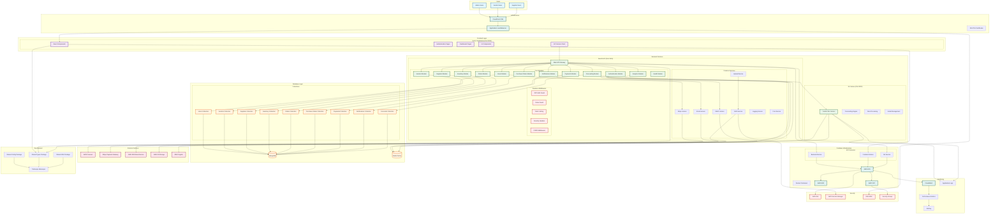

# VendorFlow Platform Architecture Diagram

```mermaid
graph TB
    %% External Users
    subgraph "Users"
        U1[Admin Users]
        U2[Vendor Users]
        U3[Supplier Users]
    end

    %% Frontend Layer
    subgraph "Frontend Layer"
        subgraph "Next.js Application (Port 3005)"
            FE[React Components]
            AUTH[Authentication Pages]
            DASH[Dashboard Pages]
            UI[UI Components]
            API_CLIENT[API Service Client]
        end
    end

    %% Load Balancer & CDN
    subgraph "Infrastructure"
        ALB[Application Load Balancer]
        CF[CloudFront CDN]
        CERT[SSL/TLS Certificates]
    end

    %% Backend Services
    subgraph "Backend Services"
        subgraph "NestJS API (Port 3004)"
            MAIN_API[Main API Gateway]
            
            subgraph "Core Modules"
                AUTH_MOD[Authentication Module]
                USER_MOD[Users Module]
                VENDOR_MOD[Vendors Module]
                SUPPLIER_MOD[Suppliers Module]
                INVENTORY_MOD[Inventory Module]
                ORDER_MOD[Orders Module]
                PO_MOD[Purchase Orders Module]
                PAYMENT_MOD[Payments Module]
                NOTIFICATION_MOD[Notifications Module]
                ANALYTICS_MOD[Analytics Module]
                FORECAST_MOD[Forecasting Module]
                HEALTH_MOD[Health Module]
            end

            subgraph "Common Services"
                RBAC[RBAC Service]
                EMAIL[Email Service]
                UPLOAD[Upload Service]
                STRIPE_SVC[Stripe Service]
                AWS_SVC[AWS Service]
                LOGGING[Logging Service]
                CRON[Cron Service]
            end

            subgraph "Guards & Middleware"
                JWT_GUARD[JWT Auth Guard]
                ROLES_GUARD[Roles Guard]
                THROTTLE[Rate Limiting]
                HELMET[Security Headers]
                CORS[CORS Middleware]
            end
        end

        subgraph "ML Service (Port 8002)"
            ML_API[FastAPI ML Service]
            FORECAST_ENGINE[Forecasting Engine]
            DATA_PROC[Data Processing]
            MODEL_MGMT[Model Management]
        end
    end

    %% Database Layer
    subgraph "Database Layer"
        MONGO[(MongoDB)]
        REDIS[(Redis Cache)]
        
        subgraph "Collections"
            USERS_COL[Users Collection]
            VENDORS_COL[Vendors Collection]
            SUPPLIERS_COL[Suppliers Collection]
            INVENTORY_COL[Inventory Collection]
            ORDERS_COL[Orders Collection]
            PO_COL[Purchase Orders Collection]
            PAYMENTS_COL[Payments Collection]
            NOTIFICATIONS_COL[Notifications Collection]
            FORECASTS_COL[Forecasts Collection]
        end
    end

    %% External Services
    subgraph "External Services"
        AWS_FORECAST[AWS Forecast]
        STRIPE[Stripe Payment Gateway]
        SES[AWS SES Email Service]
        S3[AWS S3 Storage]
        COGNITO[AWS Cognito]
    end

    %% Container Orchestration
    subgraph "Container Infrastructure"
        DOCKER[Docker Containers]
        ECS[AWS ECS]
        ECR[AWS ECR]
        VPC[AWS VPC]
        
        subgraph "ECS Services"
            ECS_BACKEND[Backend Service]
            ECS_FRONTEND[Frontend Service]
            ECS_ML[ML Service]
        end
    end

    %% Monitoring & Observability
    subgraph "Monitoring"
        CLOUDWATCH[CloudWatch]
        LOGS[Application Logs]
        METRICS[Performance Metrics]
        ALERTS[Alerting]
    end

    %% Development Tools
    subgraph "Development"
        TURBO[Turborepo Monorepo]
        SHARED_CONFIG[Shared Config Package]
        SHARED_TYPES[Shared Types Package]
        SHARED_UTILS[Shared Utils Package]
    end

    %% Security Layer
    subgraph "Security"
        IAM[AWS IAM]
        SECRETS[AWS Secrets Manager]
        WAF[AWS WAF]
        SECURITY_GROUPS[Security Groups]
    end

    %% User Flow Connections
    U1 --> CF
    U2 --> CF
    U3 --> CF
    
    CF --> ALB
    ALB --> FE
    
    %% Frontend to Backend
    API_CLIENT --> MAIN_API
    
    %% Backend Internal Connections
    MAIN_API --> AUTH_MOD
    MAIN_API --> USER_MOD
    MAIN_API --> VENDOR_MOD
    MAIN_API --> SUPPLIER_MOD
    MAIN_API --> INVENTORY_MOD
    MAIN_API --> ORDER_MOD
    MAIN_API --> PO_MOD
    MAIN_API --> PAYMENT_MOD
    MAIN_API --> NOTIFICATION_MOD
    MAIN_API --> ANALYTICS_MOD
    MAIN_API --> FORECAST_MOD
    
    %% Common Services
    AUTH_MOD --> RBAC
    USER_MOD --> EMAIL
    UPLOAD --> AWS_SVC
    PAYMENT_MOD --> STRIPE_SVC
    FORECAST_MOD --> ML_API
    
    %% Database Connections
    USER_MOD --> USERS_COL
    VENDOR_MOD --> VENDORS_COL
    SUPPLIER_MOD --> SUPPLIERS_COL
    INVENTORY_MOD --> INVENTORY_COL
    ORDER_MOD --> ORDERS_COL
    PO_MOD --> PO_COL
    PAYMENT_MOD --> PAYMENTS_COL
    NOTIFICATION_MOD --> NOTIFICATIONS_COL
    FORECAST_MOD --> FORECASTS_COL
    
    USERS_COL --> MONGO
    VENDORS_COL --> MONGO
    SUPPLIERS_COL --> MONGO
    INVENTORY_COL --> MONGO
    ORDERS_COL --> MONGO
    PO_COL --> MONGO
    PAYMENTS_COL --> MONGO
    NOTIFICATIONS_COL --> MONGO
    FORECASTS_COL --> MONGO
    
    %% Cache Connections
    AUTH_MOD --> REDIS
    RBAC --> REDIS
    ANALYTICS_MOD --> REDIS
    
    %% External Service Connections
    ML_API --> AWS_FORECAST
    STRIPE_SVC --> STRIPE
    EMAIL --> SES
    AWS_SVC --> S3
    AUTH_MOD --> COGNITO
    
    %% Container Infrastructure
    MAIN_API --> ECS_BACKEND
    FE --> ECS_FRONTEND
    ML_API --> ECS_ML
    
    ECS_BACKEND --> ECS
    ECS_FRONTEND --> ECS
    ECS_ML --> ECS
    
    ECS --> ECR
    ECS --> VPC
    
    %% Monitoring Connections
    ECS --> CLOUDWATCH
    MAIN_API --> LOGS
    ML_API --> LOGS
    CLOUDWATCH --> METRICS
    METRICS --> ALERTS
    
    %% Security Connections
    ECS --> IAM
    AWS_SVC --> SECRETS
    ALB --> WAF
    VPC --> SECURITY_GROUPS
    
    %% Development Structure
    FE --> SHARED_TYPES
    MAIN_API --> SHARED_TYPES
    ML_API --> SHARED_TYPES
    
    SHARED_CONFIG --> TURBO
    SHARED_TYPES --> TURBO
    SHARED_UTILS --> TURBO

    %% Styling
    classDef userClass fill:#e1f5fe,stroke:#01579b,stroke-width:2px
    classDef frontendClass fill:#f3e5f5,stroke:#4a148c,stroke-width:2px
    classDef backendClass fill:#e8f5e8,stroke:#1b5e20,stroke-width:2px
    classDef databaseClass fill:#fff3e0,stroke:#e65100,stroke-width:2px
    classDef externalClass fill:#fce4ec,stroke:#880e4f,stroke-width:2px
    classDef infraClass fill:#e0f2f1,stroke:#004d40,stroke-width:2px
    classDef securityClass fill:#ffebee,stroke:#b71c1c,stroke-width:2px

    class U1,U2,U3 userClass
    class FE,AUTH,DASH,UI,API_CLIENT frontendClass
    class MAIN_API,AUTH_MOD,USER_MOD,VENDOR_MOD,SUPPLIER_MOD,INVENTORY_MOD,ORDER_MOD,PO_MOD,PAYMENT_MOD,NOTIFICATION_MOD,ANALYTICS_MOD,FORECAST_MOD,HEALTH_MOD,ML_API backendClass
    class MONGO,REDIS,USERS_COL,VENDORS_COL,SUPPLIERS_COL,INVENTORY_COL,ORDERS_COL,PO_COL,PAYMENTS_COL,NOTIFICATIONS_COL,FORECASTS_COL databaseClass
    class AWS_FORECAST,STRIPE,SES,S3,COGNITO externalClass
    class ALB,CF,ECS,ECR,VPC,CLOUDWATCH infraClass
    class IAM,SECRETS,WAF,SECURITY_GROUPS,JWT_GUARD,ROLES_GUARD,THROTTLE,HELMET,CORS securityClass
```
